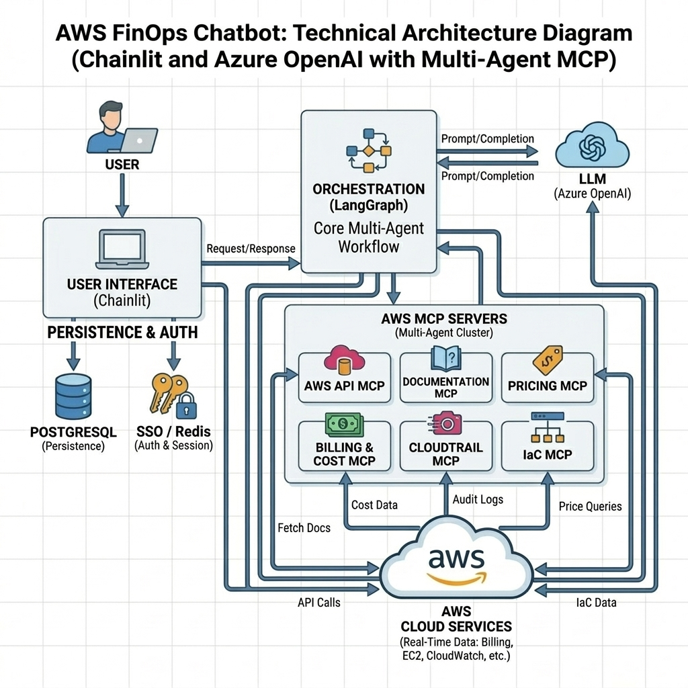

<div align="center">
  <h1>AWS FinOps Chatbot</h1>
  <p><strong>An AI-driven assistant built to analyze AWS billing, optimize costs, and track resource usage.</strong></p>
</div>

---

## 📖 Overview

**AWS FinOps Chatbot** combines the power of **advanced Generative AI** with a comprehensive suite of **AWS MCP (Model Context Protocol) servers** to seamlessly retrieve real-time AWS API telemetry, billing metrics, pricing data, CloudTrail audits, and Infrastructure as Code (IaC) configurations. Built on top of a robust **LangGraph** orchestration workflow, the bot provides interactive, strictly domain-bound insights into your cloud infrastructure via a sleek **Chainlit** web UI. For privacy-conscious users and organizations, the application natively supports local **Ollama** models, ensuring that your sensitive infrastructure data never leaves your secure environment.

Whether you want to analyze deep spending trends, correlate CloudWatch metrics to find unutilized resources, review security audits, or set up customizable cost guardrails, the AWS FinOps Chatbot handles it natively and securely.



### 🌟 Key Features

* **Flexible Model Integrations**: Currently, the bot natively integrates with both Azure OpenAI and local Ollama models. Furthermore, it is designed to be easily extendable to support other large enterprise models such as Claude or Gemini.
* **Deep AWS API Integrations**: Broad coverage across the AWS ecosystem using specialized MCP servers like the API, Pricing, and Documentation tools.
* **AWS Billing & Cost Management**: Break down costs by service, region, and tags. Instantly detect monthly spend trends, budget overages, and savings plans optimizations.
* **Security & Infrastructure Audits**: Access CloudTrail logs for auditing historical user events and query IaC configurations for compliance.
* **Strict Domain-Bound Guardrails**: The bot enforces strict filtering policies to automatically reject non-AWS domain queries. Easily restrict query scopes via Account/Service allowlists.
* **Interactive Chat UI**: Features fluid response streaming, rich Markdown formatting, and smart, quick-action follow-up suggestions for deeper investigation.
* **Dockerized for Quick Setup**: With **Localstack** emulating S3 storage exclusively for Chainlit persistence (while all MCP servers securely query your real AWS account), a local application can be spun up in minutes using `docker-compose`.

---

## 🚀 Quick Setup Instructions

Follow these steps to get a local development environment running quickly so you can start chatting with your AWS data!

### Prerequisites

* [Docker](https://docs.docker.com/get-docker/) and [Docker Compose](https://docs.docker.com/compose/install/) installed.
* Valid API Keys (Azure OpenAI) and appropriate AWS authentication credentials.

### 1. Clone the Repository

Clone the project to your local machine and navigate into the directory:

```bash
git clone --depth 1 https://github.com/SedinTechnologies/aws-fin-ops-chatbot.git
cd aws-fin-ops-chatbot
```

### 2. Configure AWS IAM Credentials

The bot requires an AWS IAM Role (or User) with specific permissions to query your AWS environment.

1. **Create an IAM User or Role** in your AWS console.
2. **Attach Policies** to the user/role to grant appropriate access:
   * Each MCP server requires distinct AWS IAM permissions. Please refer to the official documentation for the minimum required policies or attach appropriate managed policies:
     * [AWS API MCP Server Permissions](https://awslabs.github.io/mcp/servers/aws-api-mcp-server#-credential-management-and-access-control)
     * [AWS Pricing MCP Server Permissions](https://awslabs.github.io/mcp/servers/aws-pricing-mcp-server#prerequisites)
     * [AWS Billing & Cost Management MCP Server Permissions](https://awslabs.github.io/mcp/servers/billing-cost-management-mcp-server#aws-authentication)
     * [AWS CloudTrail MCP Server Permissions](https://awslabs.github.io/mcp/servers/cloudtrail-mcp-server#required-iam-permissions)
     * [AWS IaC MCP Server Permissions](https://awslabs.github.io/mcp/servers/aws-iac-mcp-server#iam-permissions)

3. **Configure Authentication Credentials**:
   * **If using an IAM User**: Generate an Access Key in the AWS Console. Open the `aws.env` file in the [secrets](secrets/) directory and add your credentials:

     ```env
     AWS_ACCESS_KEY_ID=your_access_key_here
     AWS_SECRET_ACCESS_KEY=your_secret_key_here
     ```

   * **If using an IAM Role (e.g., EC2 Instance Profile / ECS Task Role)**: The application will automatically inherit the IAM credentials from the compute environment. You can remove them from `aws.env` secrets file entirely.
   * **Note**: In both cases, ensure that your `AWS_DEFAULT_REGION` is correctly set in `aws.env`.

### 3. Configure Other Environment Variables

The application relies on several other environment files (`llm.env`, `chainlit.env`, etc.). You must provide the correct keys/values before proceeding.

> 📖 **Note:** For a comprehensive breakdown of all required configurations, see the **[Extended README](docs/EXTENDED_README.md)** documentation.

### 4. Prepare the Database Migrations

Set up your PostgreSQL database using the built-in Chainlit datalayer migrations:

1. Start the `data-migration` service which will run the migrations required for the Chainlit datalayer:

   ```bash
   docker compose up data-migration
   ```

2. After the data migration container exists, please check for the success message in the terminal logs to confirm that the migrations have completed successfully.

### 5. Start the Application

Start the full stack (Chainlit App, PostgreSQL, Redis, MCP Servers, and Localstack) in the background:

  ```bash
  docker compose up --build -d
  ```

Ensure all the services are running. You can check the status of the services by running the following command:

```bash
docker compose ps
```

You should see `chainlit-ui`, `redis`, `mcp-servers`, `postgres`, and `localstack` services running. If not, please troubleshoot the issue by checking the logs of the respective services.

### 6. Create a Chainlit Login User (Redis Authentication by default)

By default, the application enforces login through Chainlit, authenticating against a Redis backend. We provide a `scripts/signup.py` script to generate a user. Please replace the values of `USER_ID`, `DISPLAY_NAME`, and `PASSWORD` accordingly and then run the following command:

   ```bash
   docker compose exec -it chainlit-ui bash -c "USER_ID='[USER_ID]' \
   DISPLAY_NAME='[DISPLAY_NAME]' \
   PASSWORD='[PASSWORD]' \
   python scripts/signup.py"
   ```

   Upon successful execution, you should see the following output:

   ```text
    Stored user user:[USER_ID] in Redis.
   ```

* You can now login into the application at: **🔗 [http://localhost:8000](http://localhost:8000)** and start chatting with the bot.

---

## 📚 Advanced Documentation

For any low-level details, we've organized everything in the `docs` folder. New developers are recommended to look through these resources once they have their local environment up and running.

* **[Architecture, Environment Config & Troubleshooting](docs/EXTENDED_README.md)**: Deep dive into the flow, the exhaustive env var list, and common bug troubleshooting.
* **[LangGraph Implementation](docs/langgraph.md)**: Understand the LangGraph workflow process.
