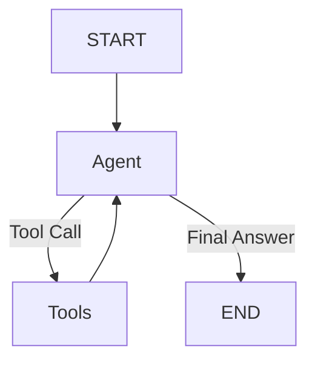

# LangGraph Implementation and Workflow

This document explains the **LangGraph Flow** implemented in `src/langgraph_app.py`, which orchestrates the AWS FinOps Chatbot's logic using a simplified "KISS" (Keep It Simple, Stupid) architecture.

## 1. The Graph Structure

We use a standard `StateGraph` from the `langgraph` library to manage the conversation state and execution flow. This replaces complex custom loops with a robust, event-driven architecture.

### Diagram



### Components

*   **`agent` Node**:
    *   **Role**: This is the decision-maker, powered by **Azure OpenAI**.
    *   **Input**: Receives the current history of messages (`MessagesState`).
    *   **Logic**: It analyzes the conversation and decides whether to:
        1.  **Call a Tool**: If it needs data (e.g., "Call Cost Explorer").
        2.  **Generate a Response**: If it has enough information (Final Answer).
    *   **Implementation**: Uses `llm.bind_tools(tools)` to make the LLM aware of available MCP tools.

*   **`tools` Node**:
    *   **Role**: The executor.
    *   **Input**: Tool calls generated by the `agent`.
    *   **Logic**: It executes the requested tools using the actual MCP tool objects (e.g., `get_cost_and_usage`).
    *   **Implementation**: Uses the prebuilt `ToolNode` from `langgraph.prebuilt`.

*   **`tools_condition` (Conditional Edge)**:
    *   **Role**: The router.
    *   **Logic**: Checks the output of the `agent` node:
        *   **If `tool_calls` are present**: Routes the flow to the `tools` node.
        *   **If no tool calls**: Routes the flow to `END` (finishing the turn).

*   **Loop**:
    *   After the `tools` node executes, the graph **always loops back** to the `agent` node.
    *   This allows the agent to "see" the tool's output and formulate a final natural language response for the user.

## 2. Streaming Mechanism

To ensure a responsive UI and avoid serialization errors, we use a robust streaming approach.

*   **Method**: `astream(stream_mode="values")`
    *   Unlike token-by-token streaming (which can be fragile with complex objects), this mode streams the full state values as they are updated.
*   **Flow**:
    1.  The graph execution starts.
    2.  As nodes complete, they emit events.
    3.  The `stream_response` method filters these events:
        *   **Tool Calls**: Ignored (internal processing).
        *   **Final Answer**: The content is yielded to the UI.
    4.  **Deduplication**: A `last_content` tracker ensures that we don't display duplicate text updates in the UI.

## 3. System Prompt & Suggestions

The behavior and look-and-feel of the bot are controlled by the `SYSTEM_PROMPT`.

### Persona & Formatting
*   **Persona**: "Advanced AWS FinOps Assistant".
*   **Formatting Rules**:
    *   **No H1 Headers**: Enforces `##` or `###` to keep headers sized appropriately.
    *   **Emojis**: Encourages liberal use of icons (💰, ☁️, 📈) for a robust UI.
    *   **Markdown**: Enforces tables and bold text for readability.

### Interactive Suggestions
*   **Logic**: The prompt instructs the model to append a structured JSON block at the end of every response.
*   **Structure**:
    ```json
    [
      {
        "question": "Show me cost breakdown by service",
        "label": "Cost by Service",
        "description": "See spend per AWS service",
        "icon": "💰"
      }
    ]
    ```
*   **Rendering**: `src/app.py` parses this JSON block, strips it from the visible text, and renders it as interactive **Chainlit Actions** (buttons) below the message.
