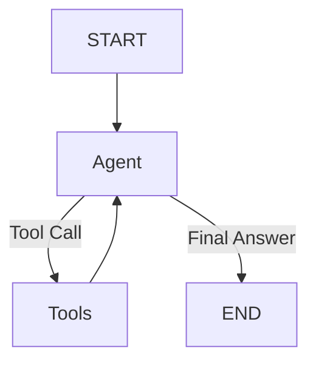

# LangGraph Implementation and Workflow

This document explains the **LangGraph Flow** implemented in [src/langgraph_client.py](../src/langgraph_client.py), which orchestrates the AWS FinOps Chatbot logic using a streamlined, minimalist architecture.

## 1. The Graph Structure

We use a standard `StateGraph` from the `langgraph` library to manage the conversation state and execution flow. This replaces complex custom loops with a robust, event-driven architecture.

### Diagram



### Components

* **`agent` Node**:
  * **Role**: This is the decision-maker, powered by **Generative AI**.
  * **Input**: Receives the current history of messages (`MessagesState`).
  * **Logic**: It analyzes the conversation and decides whether to:
    1. **Call a Tool**: If it needs data (e.g., "Call Cost Explorer").
    2. **Generate a Response**: If it has enough information (Final Answer).
  * **Implementation**: Uses `llm.bind_tools(tools)` to make the LLM aware of available MCP tools.

* **`tools` Node**:
  * **Role**: The executor.
  * **Input**: Tool calls generated by the `agent`.
  * **Logic**: It executes the requested tools using the actual MCP tool objects (e.g., `get_cost_and_usage`).
  * **Implementation**: Uses the prebuilt `ToolNode` from `langgraph.prebuilt`.

* **`tools_condition` (Conditional Edge)**:
  * **Role**: The router.
  * **Logic**: Checks the output of the `agent` node:
    * **If `tool_calls` are present**: Routes the flow to the `tools` node.
    * **If no tool calls**: Routes the flow to `END` (finishing the turn).

* **Loop**:
  * After the `tools` node executes, the graph **always loops back** to the `agent` node.
  * This allows the agent to "see" the tool's output and formulate a final natural language response for the user.

## 2. Streaming Mechanism

To ensure a responsive UI and provide a real-time conversational experience, we use LangGraph's native message chunk streaming.

* **Method**: `astream(stream_mode="messages")`
  * This mode streams token-by-token chunks dynamically as the LLM generates them, providing an optimal real-time user experience.
* **Flow**:
  1. The graph execution begins processing inputs contextually.
  2. As the agent iterates, `stream_response` listens to the event bus.
  3. **Filtering**: We specifically filter events looking for `metadata.get("langgraph_node") == "agent"`. This strictly ignores internal tool output iterations and only captures the LLM's response generation.
  4. **Token Processing**: As long as the `msg.content` is a standard string, the chunk is directly yielded out to the Chainlit UI step mechanism, creating a smooth, real-time typing effect.

## 3. System Prompt & Suggestions

The behavior and look-and-feel of the bot are controlled by the `SYSTEM_PROMPT`.

### Persona & Formatting

* **Persona**: "Advanced AWS FinOps Assistant".
* **Formatting Rules**:
  * **No H1 Headers**: Enforces `##` or `###` to keep headers sized appropriately.
  * **Emojis**: Encourages liberal use of icons (💰, ☁️, 📈) for a robust UI.
  * **Markdown**: Enforces tables and bold text for readability.

### Interactive Suggestions

* **Logic**: The prompt instructs the model to append a structured block at the very end of every response.
* **Structure**:

  ```text
  suggestions:
  Show me cost breakdown by service
  Show me a 6-month forecast
  What are the top untagged resources?
  ```

* **Rendering**: `src/app.py` parses this 3-line text block, strips it from the visible text stream, and renders it as interactive **Chainlit Actions** (buttons) below the message for immediate follow‐up.

## 4. Integrated Tools

The agent is equipped with a comprehensive suite of AWS tools provided by multiple MCP servers. These tools allow the agent to:

* Analyze costs (Cost Explorer, Billing)
* Monitor resources (CloudWatch)
* Audit activity (CloudTrail)
* Check pricing (Pricing)
* Manage resources (Cloud Control API)

For a detailed list of available tools and servers, see the Data Retrieval section in the **[Extended Architecture Documentation](EXTENDED_README.md)**.
